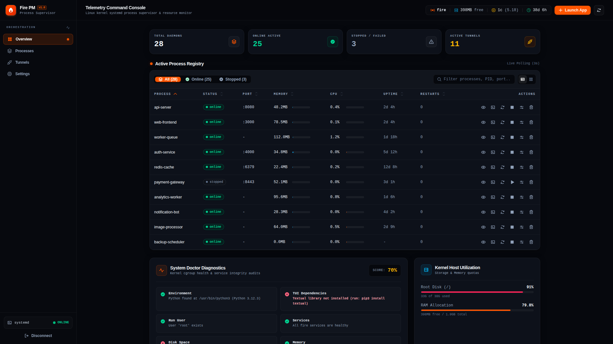
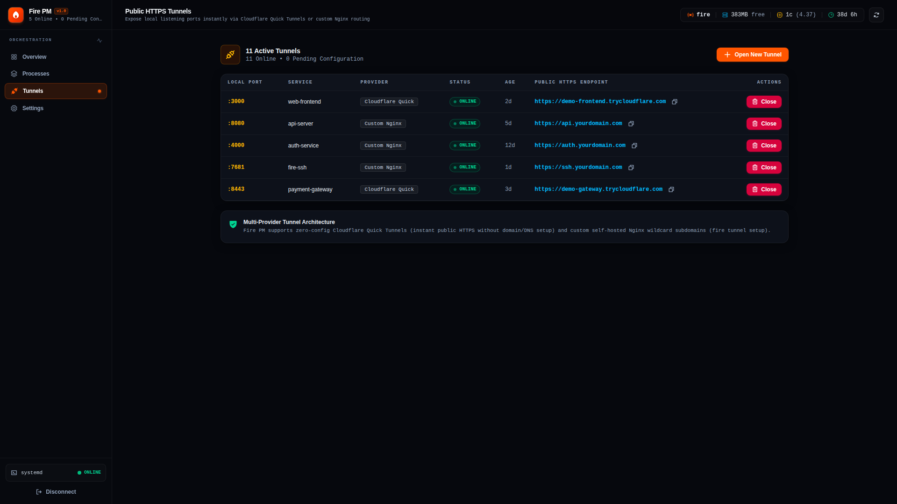
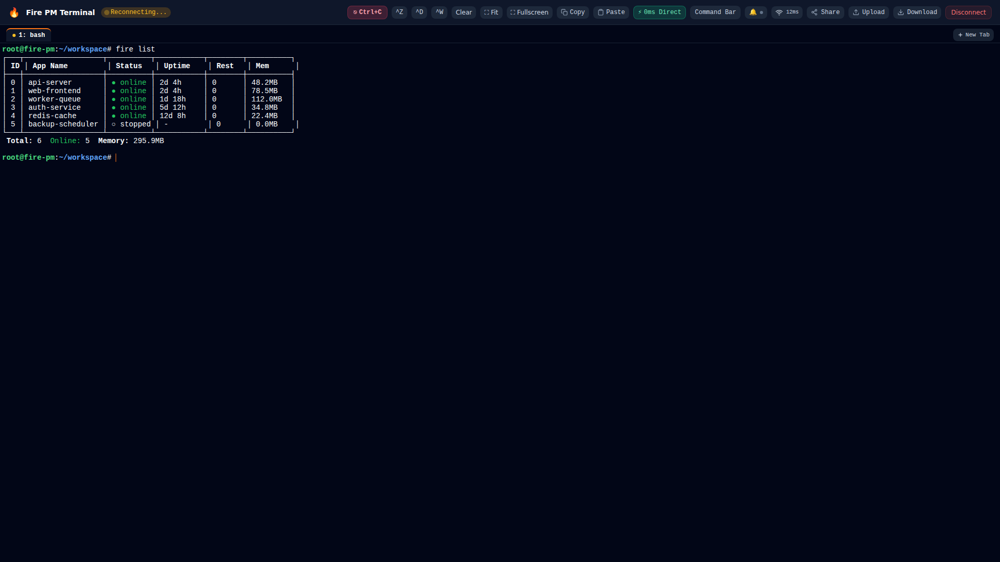
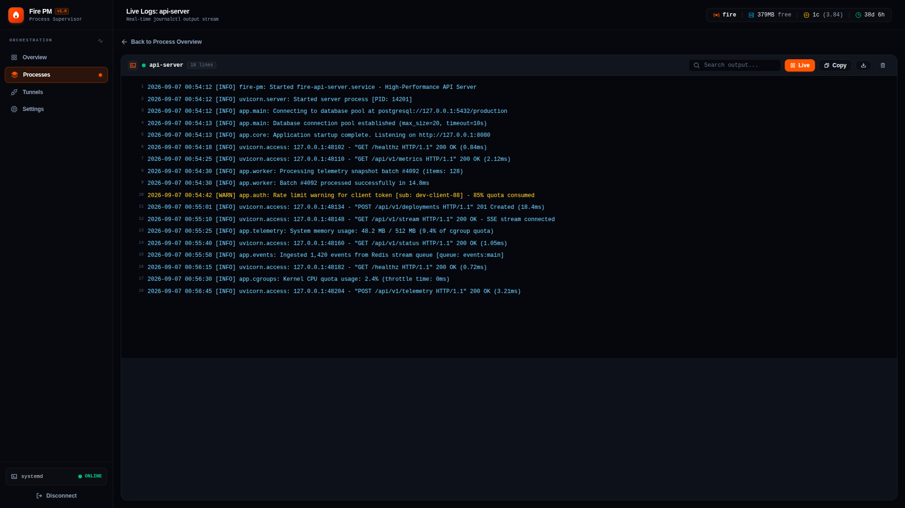

<div align="center">

# 🔥 Fire PM

**The lightweight, Linux-native process & application management platform.**

[](LICENSE)
[](#prerequisites)
[](#-architecture--philosophy)
[](web/)
[](tui/)
[](CONTRIBUTING.md)

<p align="center">
  <a href="#-quick-install">Quick Install</a> •
  <a href="#-interactive-terminal-ui-tui">Terminal UI</a> •
  <a href="#-cli-command-reference">CLI Reference</a> •
  <a href="#-public-https-tunnels">Public Tunnels</a> •
  <a href="#-remote-web-terminal-fire-ssh">Web Terminal</a> •
  <a href="#-developer-web-dashboard">Web Dashboard</a> •
  <a href="#-feature-comparison">Comparison</a>
</p>



</div>

---

## 🚀 Overview

**Fire PM** turns Linux `systemd` into a developer-friendly, high-performance process manager without introducing heavy background daemons or duplicate state layers. It provides three cohesive interfaces—a fast CLI, an interactive Terminal UI (TUI), and a modern Next.js 15 Web Dashboard—alongside zero-configuration public HTTPS tunnels and a secure, persistent remote browser terminal.

### Why Fire PM?

* **⚡ Zero Daemon Overhead**: Operates directly against `systemd` and Linux `cgroups`. No continuous runtime daemon eating 80+ MB of RAM just to monitor your processes.
* **🖥️ Three First-Class Surfaces**: Switch seamlessly between a scriptable CLI, an interactive keyboard-driven TUI, and a full-featured Web Dashboard.
* **🌐 Zero-Config HTTPS Tunnels**: Expose any local service instantly to the internet with Cloudflare Quick Tunnels, or route through your own wildcard domain with dynamic Nginx mapping.
* **🔒 Persistent Remote Web Terminal (`fire ssh`)**: Access an xterm-backed, password-protected server terminal in your browser with session persistence, 128 KB scrollback replay, and process group signal dispatching.
* **📊 Live Log Streaming & Metrics**: Real-time Server-Sent Events (SSE) streaming from `journalctl`, live CPU/memory telemetry, and instant log flushing.
* **🛡️ Kernel-Level Resource Limiting**: Adjust Memory and CPU cgroup limits on running services on the fly (`fire limit api 512M 50%`).
* **🔄 State Snapshots & Boot Persistence**: Dump and restore entire process fleets (`fire save` / `fire restore`), toggle system boot persistence (`fire startup` / `fire unstartup`).
* **📦 Automatic Runtime Detection**: Intelligently handles Python (virtual environments aware), Node.js, Shell scripts, and compiled binaries.

---

## ⚡ Quick Install

### 1-Liner Automated Install

Run the official installation script in your Linux terminal:

```bash
curl -fsSL https://raw.githubusercontent.com/Fire-Package/fire-pm/main/install.sh | sudo bash
```

### From Source / Git Clone

```bash
git clone https://github.com/Fire-Package/fire-pm.git
cd fire-pm
sudo ./install.sh
```

### Installation Options

| Flag / Environment Variable | Description |
| :--- | :--- |
| `--with-web` / `FIRE_INSTALL_WEB=1` | Build and configure the Next.js Web Dashboard during installation. |
| `--no-web` / `FIRE_INSTALL_WEB=0` | Skip Web Dashboard build (installs CLI and TUI only). |
| `--force` / `-f` | Overwrite local modifications when reinstalling or updating. |

### Prerequisites

* **Operating System**: Linux with `systemd` (Ubuntu 22.04+, Debian 12+, Fedora, RHEL/CentOS, Arch Linux).
* **Runtimes**: Python 3.10+ (for TUI & `fire ssh`), Node.js 20+ & `pnpm` (for Web Dashboard).
* **System Utilities**: `procps`, `iproute2`, `curl`.

---

## 🖥️ Interactive Terminal UI (TUI)

Launch the full-screen terminal dashboard by running `fire` without arguments:

```bash
fire
```

```text
┌── Fire PM Terminal Dashboard ────────────────────────────────────────────────────────┐
│  NAME          STATUS     PID      CPU      MEM       UPTIME    AUTOSTART  PORT      │
│  api-server    running    14201    0.4%     48.2 MB   2d 4h     enabled    :8080     │
│  worker-queue  running    14255    1.2%     112.0 MB  2d 4h     enabled    -         │
│  frontend      running    15110    0.0%     64.5 MB   1d 18h    enabled    :3000     │
│  test-service  stopped    -        0.0%     0.0 MB    -         disabled   -         │
└──────────────────────────────────────────────────────────────────────────────────────┘
```

### Keybindings

| Key | Action | Description |
| :---: | :--- | :--- |
| <kbd>s</kbd> | **Start / Stop** | Toggle execution state of the selected process. |
| <kbd>r</kbd> | **Restart** | Gracefully restart the selected service. |
| <kbd>e</kbd> | **Edit Unit** | Open built-in editor for the service unit file with instant reload. |
| <kbd>m</kbd> | **Resource Limits** | Configure Memory (e.g. `512M`) and CPU quota (e.g. `50%`) limits. |
| <kbd>l</kbd> | **Logs** | Open real-time `journalctl` log viewer. |
| <kbd>c</kbd> | **Clear Logs** | Flush accumulated logs for the selected service. |
| <kbd>v</kbd> | **Live Cockpit** | Open focused real-time monitoring cockpit. |
| <kbd>i</kbd> | **Inspect** | Display detailed systemd properties and environment variables. |
| <kbd>t</kbd> | **Tunnels** | Open the interactive tunnel manager modal. |
| <kbd>d</kbd> | **Delete** | Stop and remove service unit from systemd. |
| <kbd>/</kbd> | **Search** | Filter process list by name or status. |
| <kbd>F5</kbd> | **Refresh** | Force immediate reload of system status. |
| <kbd>q</kbd> | **Quit** | Exit the terminal dashboard. |

---

## ⌨️ CLI Command Reference

### Process Lifecycle

```bash
# Start a script or binary (auto-detects Python, Node.js, or Bash)
fire start app.py --name my-api --env PORT=8080

# Load environment variables from a .env file (flags override file values)
fire start app.py --name my-api --env-file .env --env DEBUG=true

# Pass arguments directly to the target application
fire start worker.py --name worker -- --concurrency 4 --verbose

# Start with cgroup resource limits
fire start app.py --name heavy-task --memory 1G --cpu 80%

# Start a temporary process without auto-start on system boot
fire start worker.py --name temp-worker --no-startup

# Run under a specific Linux user
fire start app.py --name api --user www-data

# List all managed processes (tabular format)
fire list

# Machine-readable JSON output for scripting
fire list --json
```

### Process Control & Inspection

```bash
# Stop, restart, or delete a service
fire stop my-api
fire restart my-api
fire delete my-api

# Stop all processes or delete all stopped services
fire stop all
fire delete --stopped

# Inspect detailed service metadata and configuration
fire info my-api

# Open live monitoring cockpit for a specific process
fire live my-api

# Update CPU and Memory limits on an active service
fire limit my-api 512M 50%
```

### Logs & Diagnostics

```bash
# Stream real-time logs from journalctl
fire logs my-api

# Flush and vacuum accumulated logs
fire flush my-api
fire flush all

# Real-time multi-process resource monitor
fire monit

# Comprehensive system health and configuration check
fire doctor
fire doctor --json
```

### Boot Persistence & State Snapshots

```bash
# Enable or disable auto-start on system boot
fire startup my-api
fire startup all
fire unstartup my-api

# Save current running process state to snapshot dump
fire save
fire save /path/to/backup.json

# Restore all processes from snapshot dump
fire restore
fire restore /path/to/backup.json
```

### Shell Completion & Self-Update

```bash
# Install automatic shell completions (Bash, Zsh, Fish)
fire completion install

# Output completion script for manual sourcing
fire completion bash
fire completion zsh
fire completion fish

# Self-update Fire PM to the latest version
fire update

# Force overwrite local changes during update
fire update --force
```

---

## 🌐 Public HTTPS Tunnels

Fire PM includes built-in reverse-proxy tunneling to expose local ports over secure public HTTPS URLs without requiring third-party CLI tools or paid accounts.

<p align="center">
  
</p>

### 1. Zero-Config Quick Tunnels (Default)

Instantly expose any local port over a Cloudflare-backed HTTPS URL with **zero setup**:

```bash
# Open a tunnel for local port 3000
fire tunnel open 3000
# Output: https://random-words.trycloudflare.com

# List active tunnels
fire tunnel list
fire tunnel list --json

# Close an active tunnel
fire tunnel close 3000
```

> [!NOTE]
> Fire PM forces Cloudflare tunnels to communicate via HTTP/2 over standard TCP port 443, preventing UDP/QUIC packet loss and `ERR_QUIC_PROTOCOL_ERROR` in restricted environments.

### 2. Custom Domain Tunnels (Self-Hosted Nginx)

If you own a domain with a wildcard DNS record (`*.yourdomain.com`) and an SSL certificate, set up persistent, custom-branded tunnels powered by Nginx:

```bash
# Launch interactive configuration wizard
fire tunnel setup

# Open tunnel using your custom domain
fire tunnel open 3000 --provider custom
# Output: https://a1b2c3d4-tunnel.yourdomain.com

# Override default provider at any time
fire tunnel open 3000 --provider quick
```

### Tunnel Provider Comparison

| Feature | **Fire PM (Quick)** | **Fire PM (Custom)** | **ngrok (Free)** | **localtunnel** | **Tailscale Funnel** |
| :--- | :---: | :---: | :---: | :---: | :---: |
| **Setup Required** | ❌ None | `fire tunnel setup` | Account signup | `npm install` | Tailscale auth |
| **Account / Sign-up** | ❌ None | ❌ None | ✅ Required | ❌ None | ✅ Required |
| **Custom Wildcard Domain** | ❌ | ✅ Your domain | Paid plan only | ❌ | ❌ |
| **Persistent Hostnames** | ❌ Dynamic | ✅ Stable | Paid plan only | ❌ Dynamic | ✅ Stable |
| **Automatic HTTPS** | ✅ Yes | ✅ Your certs | ✅ Yes | ✅ Yes | ✅ Yes |
| **Rate Limits** | Cloudflare fair-use | None (your server) | 40 req/min | Severe / unstable | Tailscale quotas |
| **Concurrent Tunnels** | Unlimited | Unlimited | 1 (free tier) | 1 | Restricted |
| **Built into Process Manager** | ✅ Yes | ✅ Yes | ❌ Separate tool | ❌ Separate tool | ❌ Separate tool |

---

## 🔒 Remote Web Terminal (`fire ssh`)

Access your server's interactive terminal directly from any web browser over an encrypted, password-protected HTTPS tunnel.

<p align="center">
  
</p>

### Usage

```bash
# Start remote terminal session (interactively prompts for password)
fire ssh

# Start with a specific password and run in background
fire ssh --password mysecret123 --daemon

# Set or update persistent default password
fire ssh password

# List active terminal sessions
fire ssh list

# Terminate active remote terminal session
fire ssh close
```

### Security & Terminal Engine Architecture

* **Salted PBKDF2 Password Hashing**: Passwords are authenticated using `PBKDF2-HMAC-SHA256` with 100,000 iterations and a cryptographically unique 16-byte random salt.
* **Brute-Force Rate Limiting**: Automatic IP lockout after 5 consecutive failed authentication attempts within a 5-minute window.
* **Persistent PTY Lifecycle**: PTY processes remain alive independently of browser disconnects. Reconnecting replays the last **128 KB scrollback buffer** seamlessly.
* **Kernel Signal Dispatching**: Pressing <kbd>Ctrl+C</kbd>, <kbd>Ctrl+Z</kbd>, or <kbd>Ctrl+D</kbd> resolves the active foreground process group via `tcgetpgrp` and dispatches signals directly to the process group (`os.killpg`), instantly stopping infinite stdout loops (e.g. `yes` or runaway logs).
* **Full Terminal Emulation**: Backed by Xterm.js with 256-color support, dynamic window resize negotiation (`TIOCSWINSZ`), and complete compatibility with interactive applications (`fire`, `htop`, `vim`, `tmux`).

---

## 📊 Developer Web Dashboard

A full-stack, responsive dashboard built with **Next.js 15 (App Router)**, **React 19**, and **Tailwind CSS v4**.

<p align="center">
  
</p>

### Starting the Web Dashboard

```bash
# Start Web UI as a managed background service
fire start /opt/fire-pm/web/start.sh --name fire-web --env PORT=3000
```

Open `http://localhost:3000` (or your configured port). On first launch, set your administrator password to unlock:

* **Live Process Overview**: Real-time process cards and data tables updated every 3 seconds.
* **Live SSE Log Streaming**: Stream `journalctl` logs with auto-scroll, regex search filtering, and line wrapping.
* **In-Browser Unit File Editor**: Edit `/etc/systemd/system/fire-*.service` files with syntax validation and instant `systemctl daemon-reload`.
* **Resource Limiting Controls**: Dynamically slide and apply Memory & CPU limits.
* **Integrated Tunnel Manager**: Open and monitor Quick or Custom tunnels directly from the browser.
* **Zero External Database**: Reads directly from `systemd` and `/etc/fire-pm/config.json`.

---

## ⚖️ Feature Comparison

| Feature | **Fire PM** | **PM2** | **Supervisord** | **Raw systemd** |
| :--- | :---: | :---: | :---: | :---: |
| **Underlying Engine** | **Linux `systemd`** | Node.js daemon | Python daemon | Linux `systemd` |
| **Daemon Memory Footprint** | **0 MB** (CLI / stateless) | ~80–120 MB | ~30–50 MB | 0 MB |
| **Native Cgroups Limits** | ✅ Instant (`fire limit`) | ❌ (Memory restart only) | ❌ | ⚠️ Manual file edits |
| **Interactive Terminal UI (TUI)** | ✅ Built-in (Textual) | ⚠️ Basic `pm2 monit` | ❌ | ❌ |
| **Developer Web Dashboard** | ✅ Modern Next.js 15 | ❌ Paid / PM2 Plus | ⚠️ Legacy Web UI | ❌ |
| **Public HTTPS Tunnels** | ✅ Zero-config Quick + Custom | ❌ | ❌ | ❌ |
| **Remote Web Terminal (`fire ssh`)** | ✅ Built-in PTY / xterm.js | ❌ | ❌ | ❌ |
| **Live Log Streaming** | ✅ Server-Sent Events (SSE) | ⚠️ CLI tail only | ⚠️ File polling | ⚠️ `journalctl -f` |
| **Multi-Language Detection** | ✅ Python (venv), Node, Shell | ⚠️ Node-first | ❌ Manual config | ❌ Manual config |
| **Boot Persistence** | ✅ Native `systemctl enable` | ⚠️ Requires `pm2 startup` | ⚠️ Custom init scripts | ✅ Native |
| **Process State Snapshots** | ✅ `fire save` / `restore` | ✅ `pm2 save` / `resurrect`| ❌ | ❌ |

---

## 🏗️ Architecture & Philosophy

```text
┌────────────────────────────────────────────────────────────────────────┐
│                          USER INTERFACES                               │
│   CLI (`app/fire`)   •   TUI (`tui/fire_tui.py`)   •   Web (`web/`)    │
└───────────────────────────────────┬────────────────────────────────────┘
                                    │
                                    ▼
┌────────────────────────────────────────────────────────────────────────┐
│                   LINUX KERNEL & SYSTEM LAYER                          │
│                                                                        │
│   • systemd (Single Source of Truth — No Duplicate State Machines)    │
│   • cgroups (Kernel Memory & CPU Quota Resource Limits)                │
│   • journald (High-Performance Structured System Logging)              │
│   • PTY Subsystem (Persistent WebSockets Terminal Emulation)           │
│   • Cloudflare HTTP/2 / Nginx (Encrypted Public Tunnels)               │
└────────────────────────────────────────────────────────────────────────┘
```

### Core Principles

1. **`systemd` is the Single Source of Truth**: Fire PM never maintains separate database state or caches that can drift out of sync. Status is resolved directly from systemd units.
2. **Strict Argument-Based Execution**: All subprocess invocations use structured argument vectors (`execFile`/`spawn`) to prevent shell injection vulnerabilities.
3. **Zero Configuration by Default**: Works immediately after installation without requiring external databases, cloud accounts, or complicated configuration files.

### Repository Layout

```text
fire-pm/
├── app/                  # Core Bash process manager engine & fire ssh PTY server
│   ├── fire              # Main executable CLI binary
│   ├── ff-service        # Service status helper
│   └── fire_ssh.py       # Remote Web Terminal WebSocket/PTY persistent engine
│
├── web/                  # Next.js 15 App Router Web Dashboard
│   ├── src/app/          # Routes, pages, and REST/SSE API endpoints
│   ├── src/components/   # React 19 UI components
│   └── src/lib/          # Systemd, journalctl, auth, and tunnel services
│
├── tui/                  # Python Textual Interactive Terminal Dashboard
│   ├── fire_tui.py       # Full-screen TUI application
│   └── requirements.txt  # Textual dependencies
│
├── assets/               # Screenshots and visual documentation assets
├── shared/               # Systemd template units and Nginx configs
├── install.sh            # Automated multi-distribution Linux installer
├── AGENT.md              # AI agent architecture reference & guidelines
└── CONTRIBUTING.md       # Contribution guide & development instructions
```

---

## 🔒 Security

* **Cryptographic Password Storage**: Passwords for Web UI and `fire ssh` are salted and hashed using `bcrypt` and `PBKDF2-HMAC-SHA256` (100,000 rounds).
* **Token Protection**: Web authentication utilizes signed JWT tokens stored in `httpOnly`, `Secure`, `SameSite=Strict` cookies.
* **Double-Submit CSRF Protection**: All mutating API endpoints require valid CSRF header tokens.
* **Input Sanitization**: Service identifiers, command arguments, and port numbers are validated against strict regex patterns.
* **Brute-Force Lockout**: IP-level rate limiters automatically lock out repeat authentication failures.

---

## 🩺 Diagnostics & Troubleshooting

Run `fire doctor` to perform an automated health audit of your environment:

```bash
fire doctor
```

```text
[✓] systemd subsystem: active and functional
[✓] Core utilities: procps, iproute2, curl found
[✓] Python environment: 3.11.2 (venv support ready)
[✓] Node.js environment: v22.16.0
[✓] Configuration: /etc/fire-pm/config.json valid
[✓] Managed services: 4 total (3 running, 0 failed, 1 stopped)
[✓] System health score: 100/100
```

### Manual Systemd Inspection

```bash
# Inspect raw unit status
systemctl status fire-<service-name>.service

# Inspect raw journal logs
journalctl -u fire-<service-name>.service -n 50 --no-pager

# Reload systemd daemon after manual unit changes
sudo systemctl daemon-reload
```

---

## 🤝 Contributing

Contributions, issues, and feature proposals are warmly welcomed! Please read our [**Contributing Guide**](CONTRIBUTING.md) for local environment setup, coding conventions, and pull request workflows.

---

## 📄 License

This project is licensed under the **MIT License** — see the [LICENSE](LICENSE) file for details.

Developed with ❤️ by [**Fire Package**](https://github.com/Fire-Package).
